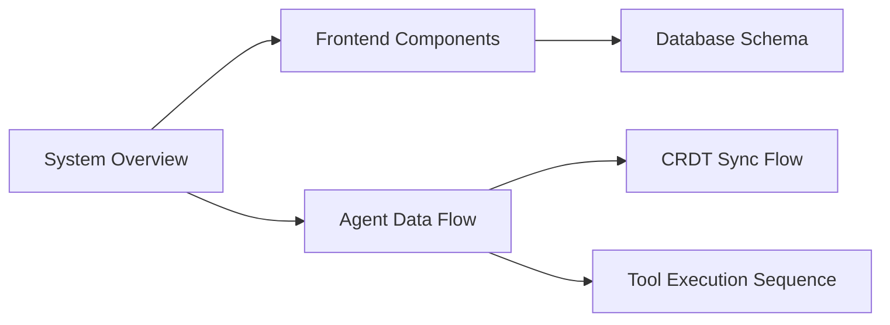
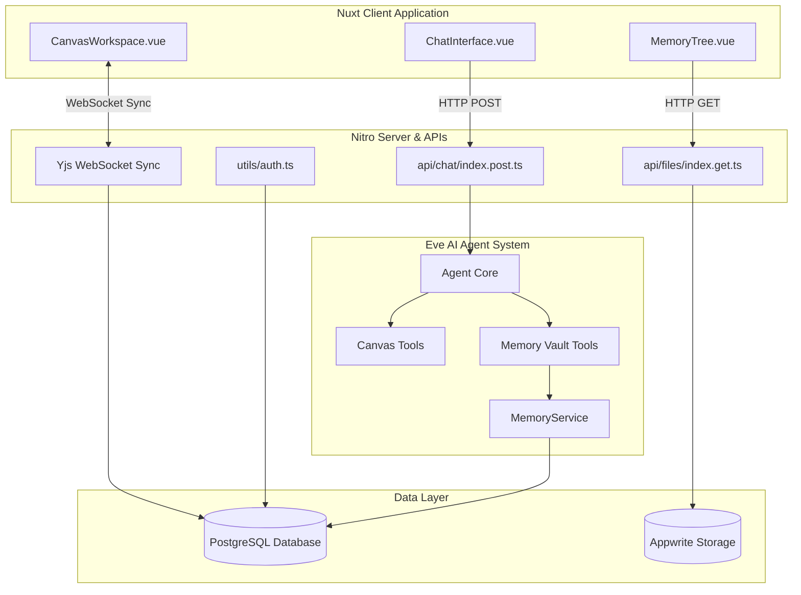
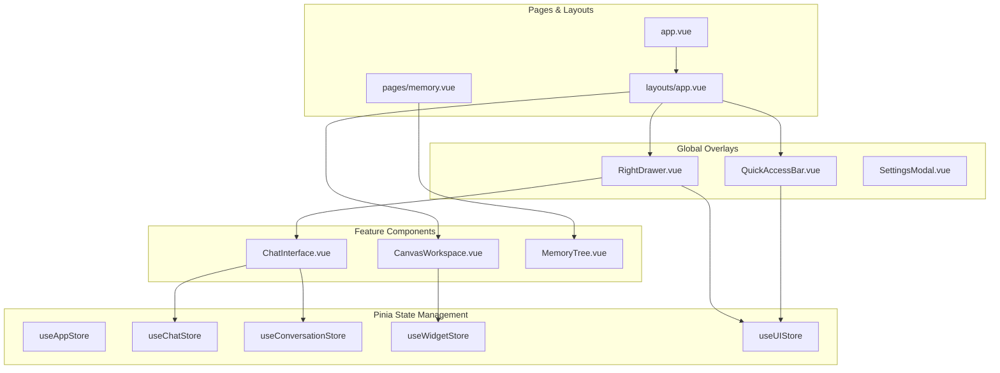
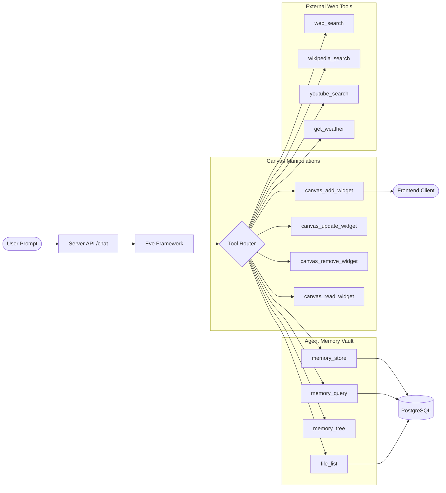
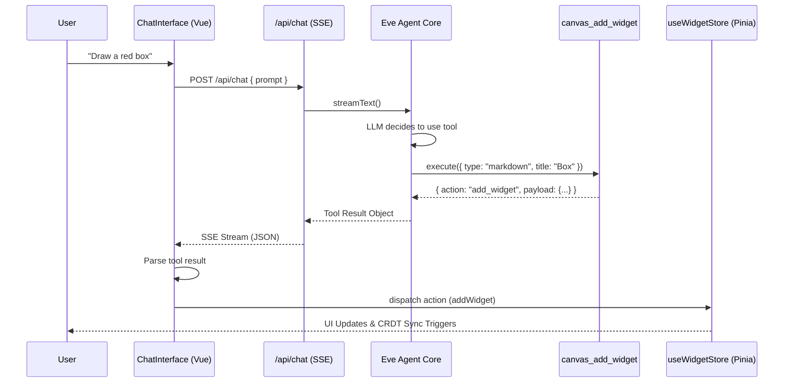

# bubbles.space

## Navigation



<!-- diagram:overview:system -->
## System Overview



<!-- diagram:component:app -->
## Frontend Components & State



<!-- diagram:dataflow:agent -->
## Agent Tool & Execution Flow



<!-- diagram:dataflow:sync -->
## CRDT Sync Engine Flow

```mermaid
graph TD
    subgraph Client [Vue Frontend]
        YDocClient[Y.Doc Local State]
        SyncWorker[Sync Interval / Polling]
        WidgetStore[Pinia Widget Store]
    end

    subgraph Server [Nitro API: /crdt/sync.post]
        YDocServer[Y.Doc Server State]
        SyncEndpoint[sync.post.ts]
        AsyncUnpack[SQL Upsert Worker]
    end

    subgraph Database [PostgreSQL]
        CRDTTable[(crdt_sync_state)]
        SQLTables[(workspace & widget tables)]
    end

    WidgetStore -->|Observer| YDocClient
    YDocClient -->|encodeStateVector| SyncWorker
    SyncWorker -->|HTTP POST (base64)| SyncEndpoint
    
    SyncEndpoint -->|Read| CRDTTable
    CRDTTable -->|Binary Buffer| YDocServer
    
    SyncEndpoint -->|applyUpdate| YDocServer
    SyncEndpoint -->|encodeStateAsUpdate| SyncWorker
    SyncWorker -->|applyUpdate| YDocClient
    
    SyncEndpoint -->|Save full state| CRDTTable
    SyncEndpoint -->|waitUntil()| AsyncUnpack
    AsyncUnpack -->|Extract JSON/Relational| SQLTables
```

<!-- diagram:sequence:tool -->
## Tool Execution Sequence (e.g., canvas_add_widget)



<!-- diagram:er:database -->
## Database Schema


