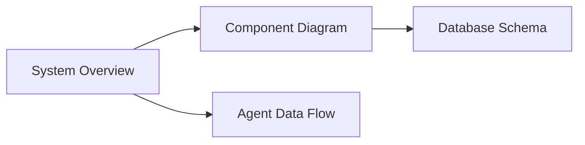
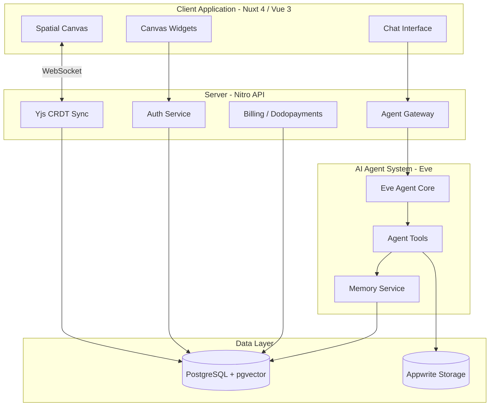
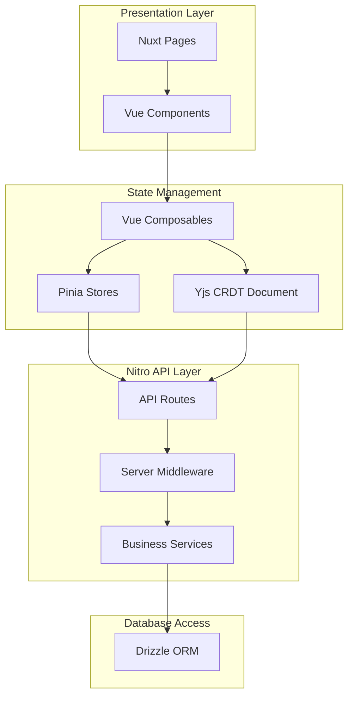
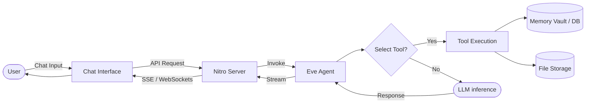
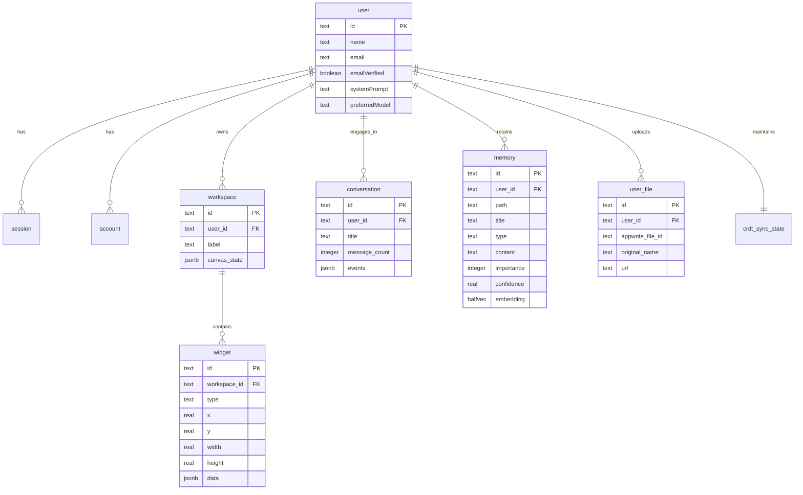

# bubbles.space

## Navigation

<!-- diagram:overview:system -->
## System Overview

<!-- diagram:component:app -->
## Application Components

<!-- diagram:dataflow:agent -->
## Agent Interaction Data Flow

<!-- diagram:er:database -->
## Database Schema

