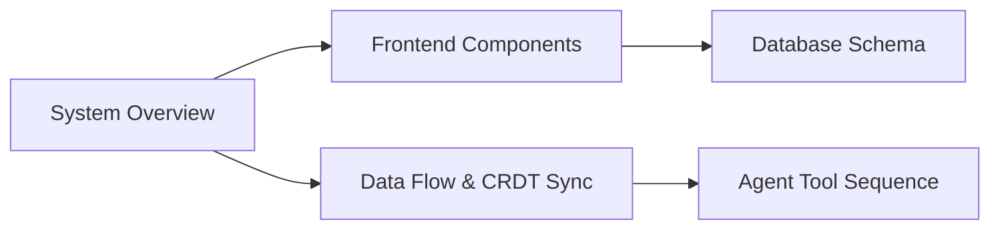
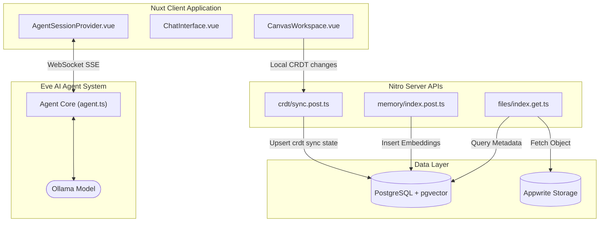
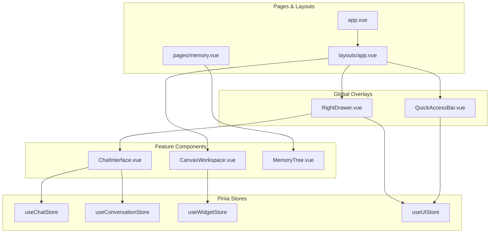
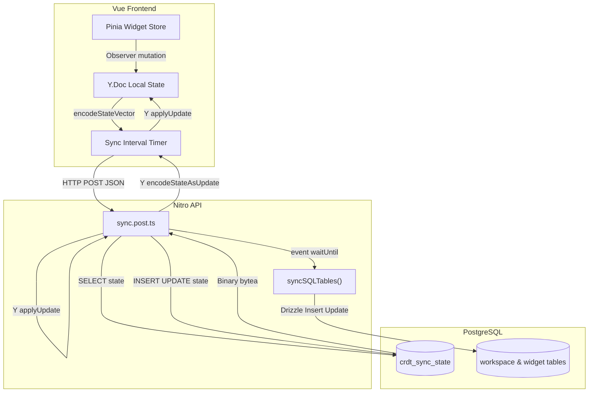
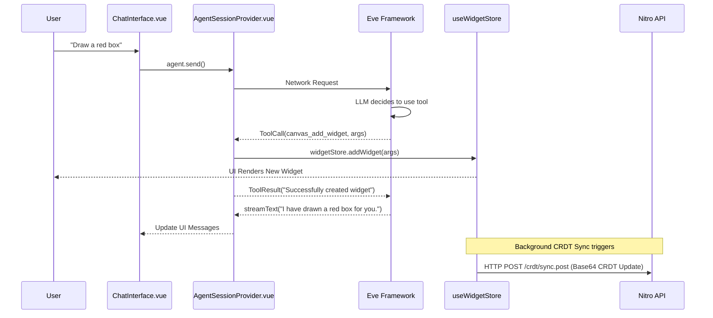
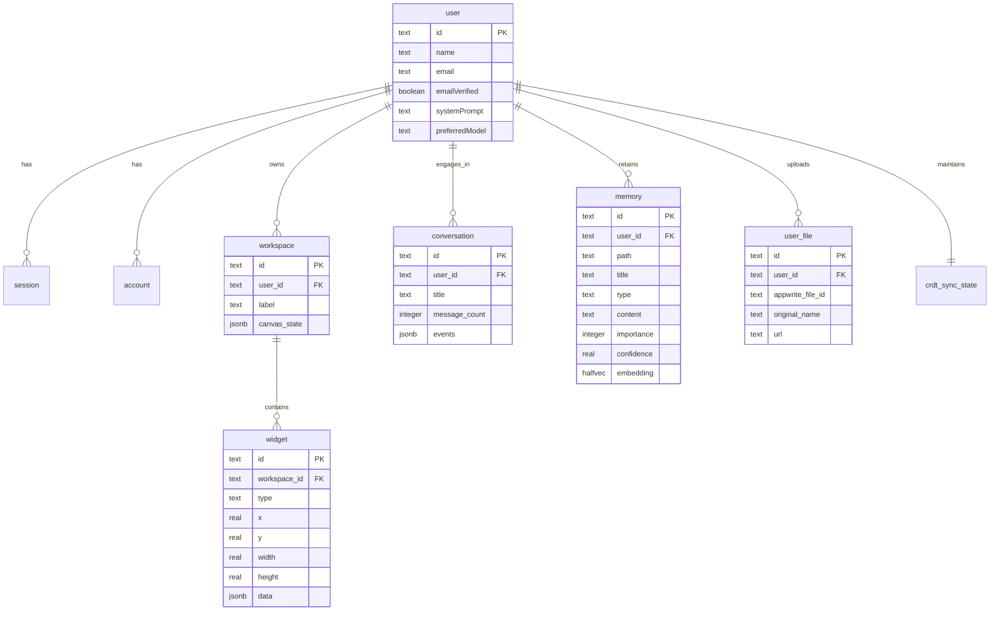

# bubbles.space

## Navigation

<!-- diagram:overview:system -->
## System Overview

<!-- diagram:component:app -->
## Frontend Components & State

<!-- diagram:dataflow:sync -->
## CRDT Sync Engine Flow

<!-- diagram:sequence:tool -->
## Tool Execution Sequence (e.g., canvas_add_widget)

<!-- diagram:er:database -->
## Database Schema

