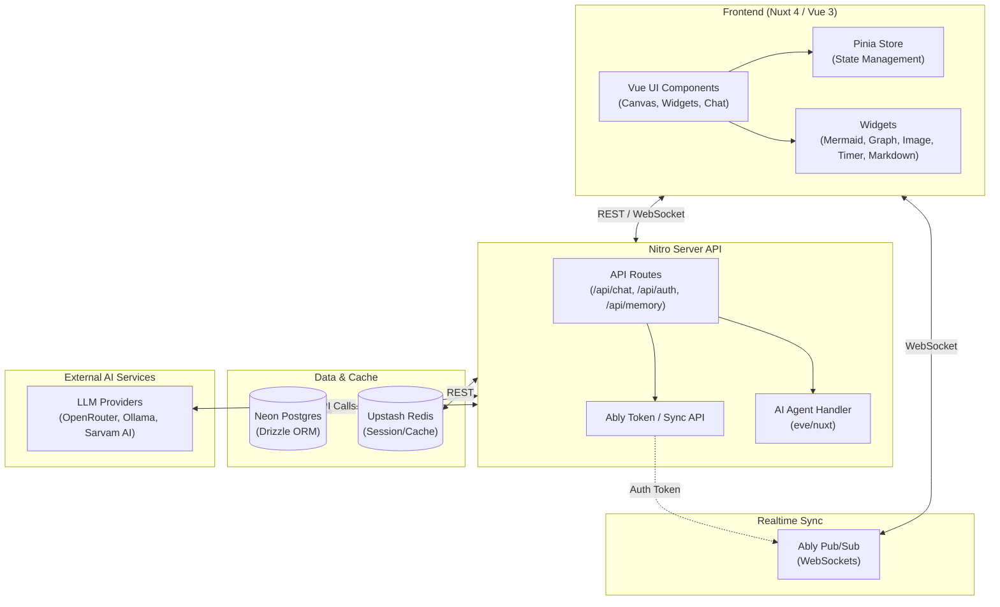

# 🫧 Bubbles.space

**Bubbles.space is a persistent AI workspace that's always open, always in sync, and helps you think, build, and get things done in the AI era.**

Stop managing apps. Open one space, stay there, and let AI help you get things done. That's Bubbles.space. It acts like a personal operating system powered by AI—your own Jarvis for work and life.

## 🌟 Core Features

- **Spatial Canvas**: An interactive, zoomable, and pan-able workspace to organize your thoughts and data visually.
- **Dynamic Widget System**: A modular widget ecosystem running directly on the canvas, including:
  - 📊 **Graph Widget**: Data visualization (Line, Bar, Pie charts) with a built-in JSON editor.
  - 🧜‍♂️ **Mermaid Widget**: Real-time rendering of complex flowcharts and diagrams using Mermaid syntax.
  - 🖼️ **Image Gallery**: A sleek image viewer with automatic carousels and smooth transitions.
  - ⏱️ **Timer Widget**: Beautiful, interactive countdown timers.
  - 📝 **Markdown Widget**: Rich text editing and display.
- **Agentic AI Workflows**: A robust, persistent chat interface powered by the [Eve Framework](https://github.com/jagreehal/eve), supporting OpenRouter, Sarvam AI (voice), and local Ollama models.
- **Realtime Sync Engine**: Multiplayer WebSocket collaboration and instant state updates powered by **Ably**, allowing seamless cross-device usage.
- **Memory & Archive**: A context-aware "Memory Tree" and Archive Panel that act as long-term storage for the AI to recall past interactions and widgets.

## 🏗️ System Architecture

Bubbles is built using a modern, deeply integrated AI-first stack:

- **Frontend**: Nuxt 4, Vue 3, Pinia
- **Backend**: Nitro Server APIs
- **Database & Auth**: Neon Postgres, Drizzle ORM, Better Auth
- **Caching & State**: Upstash Redis
- **Realtime / Sub**: Ably WebSockets



## 🛠️ Getting Started

### Prerequisites

1. Ensure you have Node.js and [pnpm](https://pnpm.io/) installed.
2. Ensure you have provisioned accounts for **Neon Postgres**, **Upstash Redis**, and **Ably**.
3. Create a `.env` file containing the required database, redis, ably, and AI provider tokens.
4. *(Optional)* Install and start [Ollama](https://ollama.com/) if using local models (e.g., `gemma4:31b-cloud`).

### Installation

Clone the repository and install dependencies:

```bash
pnpm install
```

### Database Migration

Ensure your database is up to date:

```bash
node migrate.js
```

### Development

Start the development server:

```bash
pnpm run dev
```

The application will be available at `http://localhost:3000`. The Eve agent runs seamlessly alongside the Nuxt frontend via Nitro routes, requiring no additional server startup.

## 💡 Vision

Bubbles.space is an always-on AI workspace that remembers, syncs, and helps you get things done—like having your own Jarvis for the AI era.
